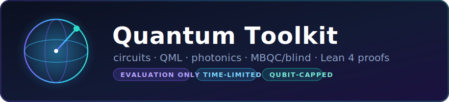

<div align="center">



# Quantum Toolkit — Evaluation Examples

**A pure-Rust quantum programming toolkit — circuits, optimization, QML, photonics, MBQC/blind
computing, and Lean 4 proofs — that you can try, on real binaries, in five minutes.**


-2ea043)

`EVALUATION ONLY` · `TIME-LIMITED` · `QUBIT-CAPPED` · `WORK IN PROGRESS` · see [LICENSE](./LICENSE)

🔗 **https://github.com/Anzaetek/quantum-examples** · companion (algo-trading):
**[flow-master-examples](https://github.com/zeta1999/flow-master-examples)**

</div>

> ⚖️ **This is an evaluation product. You can test it — that is all.** The binaries are
> time-limited (they expire) and capability-limited (a maximum qubit count). No production,
> commercial, or redistribution use — see [LICENSE](./LICENSE). A commercial license is available
> separately.

> 🚧 **Work in progress.** This evaluation bundle is early and moving fast. The macOS bundle is the
> complete tour (incl. QML/finance); the Linux **CPU-only** bundles ship the libtorch-free CLIs
> (`quantum` / `quantum-server` / `quantum-client`) and therefore **skip the ML/finance demos**
> (06–08) — those need a paired libtorch runtime (macOS bundle, or the forthcoming Linux+CUDA
> build). Some platforms (Linux+CUDA, RISC-V) are still ⏳. Expect rough edges.

---

## What's here

```
quantum-examples/
├── dist/            time-limited, qubit-capped binaries, per platform (see below)
├── demo/            13 runnable example subfolders (Aria/QASM models + harnesses)
├── editors/         Aria syntax highlighting (VS Code · Neovim · tree-sitter)
├── docs/
│   └── aria-tutorial.md   learn the Aria quantum language
└── LICENSE          evaluation license
```

## The toolkit at a glance

```
        Aria model  ──spec extract──▶  Lean 4 theorem        (prove it)
            │
   ┌────────┴────────┐
   ▼                 ▼
  QASM ──info/compile/optimize──▶  circuit stats + gates     (inspect it)
   │
   ├── mbqc ──▶ measurement pattern ──remote──▶ BLIND run    (delegate it, privately)
   │
   └── quantum-finance / qos / qml ──▶ trained quantum models (run QML)
                                                              all on the SHIPPED binaries
```

## Quick start

```bash
# 1. Pick the bundle for your platform from dist/ and extract it:
tar xzf dist/quantum-dist-<platform>-test-*.tar.gz
export QUANTUM_DIST="$(pwd)/dist-<platform>-test"

# 2. Run the whole guided tour (numbers only, each step self-checks):
./demo/run-all.sh
```

The bundle is **fully self-contained** — no toolkit source, no Rust, no Python, no `jq`. The
included `quantum-client` binary speaks the server's JSON-RPC natively, so the demos and self-test
need nothing on the host but a shell. Verified end-to-end in a **stock `debian:bookworm-slim`**
container with no packages installed:

```bash
docker run --rm --platform linux/amd64 -v "$PWD":/qx:ro debian:bookworm-slim bash -c '
  mkdir -p /tmp/q && tar xzf /qx/dist/quantum-dist-linux-amd64-cpu-test-*.tar.gz -C /tmp/q
  export QUANTUM_DIST="$(ls -d /tmp/q/dist-*)" && bash "$QUANTUM_DIST/run.sh"'
# -> RUN OK: server pong + Bell info (Qubits=2, H-count=1) + QOS O(1/N^2) verified numerically
```

> The optional `clients/client.sh` shell helper auto-delegates to that binary; it only falls back to
> `python3`/`jq` in a bare source checkout where the binary isn't present.

## The 13 demos (each runs against the binaries)

| # | Folder | Shows |
|---|--------|-------|
| 01 | `demo/01-bell` | inspect a circuit (`info` / `compile` / `optimize`) + Aria→Lean 4 |
| 02 | `demo/02-qft` | a parameterized QFT model → Lean 4 at n=3/4/5 |
| 03 | `demo/03-rust-harness` | a standalone Rust app talking to `quantum-server` (JSON-RPC) |
| 04 | `demo/04-qos` | Quantum Oracle Sketching — the O(1/N²) sample-complexity law |
| 05 | `demo/05-optimizer` | a real optimizer reduction (naive 7 gates → minimal 3) |
| 06 | `demo/06-finance` | regime labelling + backtest on a **synthetic** series |
| 07 | `demo/07-qml-qcbm` | a Quantum Circuit Born Machine model, trained (KL→0) |
| 08 | `demo/08-qml-classifier` | a variational quantum classifier, trained as a QNN |
| 09 | `demo/09-mbqc` | compile a circuit to a one-way **measurement pattern** |
| 10 | `demo/10-ubqc` | **blind** quantum computation on a remote server |
| 11 | `demo/11-lean4` | export Aria models to **Lean 4** theorems (+ MBQC certificate) |
| 12 | `demo/12-ecc` | **surface-code error correction** — `[[9,1,3]]`/`[[25,1,5]]`/`[[49,1,7]]` syndrome + MWPM decode across 4 simulator backends; d=7 via Pauli propagation |
| 13 | `demo/13-pauliprop` | **Pauli propagation** — `quantum expect` reads `⟨O⟩` via a Heisenberg Pauli-string tree: exact non-Clifford cross-check, a truncation budget, and a 24-qubit GHZ where the dense statevector can't fit |

> Demos 12–13 (`ecc`, `expect`) run on the **macOS** bundle (native `omega-sim`
> backends). On the cross-built **Linux** bundles those backends ship inert, so demos
> 12–13 **skip cleanly** (build natively for them). Demo 03 builds a small Rust client
> crate and skips when `cargo` isn't installed; the other demos need only the shipped
> binaries.

> All finance/QML data is **synthetic** (a rescaled, noised, renamed series — *not* real market
> data); see `demo/data/README.md`.

## Platforms

Evaluation bundles are provided per platform in `dist/`:

| Platform | Triple | In `dist/` | Notes |
|---|---|---|---|
| macOS (Apple Silicon) | `aarch64-apple-darwin` | ✅ | Metal + CPU, **incl. QML/finance** |
| Linux x86-64 | `x86_64-unknown-linux-gnu` | ✅ | CPU (core CLIs) |
| Linux arm64 | `aarch64-unknown-linux-gnu` | ✅ | CPU (core CLIs) |
| Linux x86-64 + CUDA | `x86_64-unknown-linux-gnu` | ⏳ | GPU — built on the Linux box |
| Linux RISC-V | `riscv64gc-unknown-linux-gnu` | ⏳ | CPU |

The `quantum` / `quantum-server` / `quantum-client` CLIs are libtorch-free and portable (the Linux
CPU bundles ship these); the QML/finance binary ships where a paired libtorch runtime is available
(macOS bundle, and the Linux+CUDA build). **Every binary is time-limited** (it expires) and the CLI
is **qubit-capped** — 12 qubits for general circuits, with a separate 64-qubit ceiling for the
scalable `quantum ecc` / `quantum expect` (Pauli-propagation) paths (see `TEST-BUILD.txt`).

## Aria — the quantum language

The models are written in **Aria**, a small readable DSL that exports to QASM, Lean 4, and MBQC
patterns. Start with [`docs/aria-tutorial.md`](./docs/aria-tutorial.md), and install editor
highlighting:

```bash
./editors/install.sh     # VS Code + Neovim + tree-sitter
```

## When a bundle expires

Evaluation binaries print `this build expired …` and stop running once the window passes — that is
by design. Request a fresh evaluation bundle or a commercial license.
